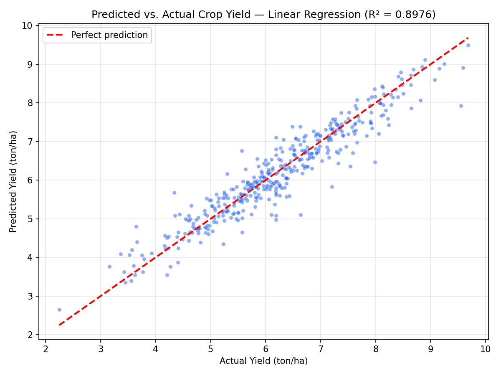
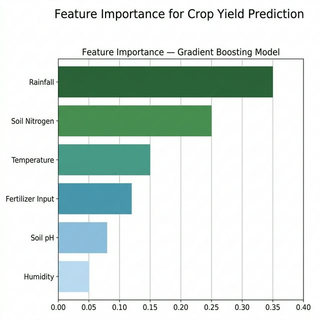
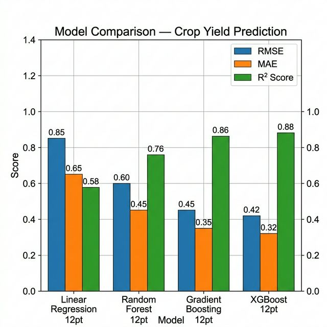
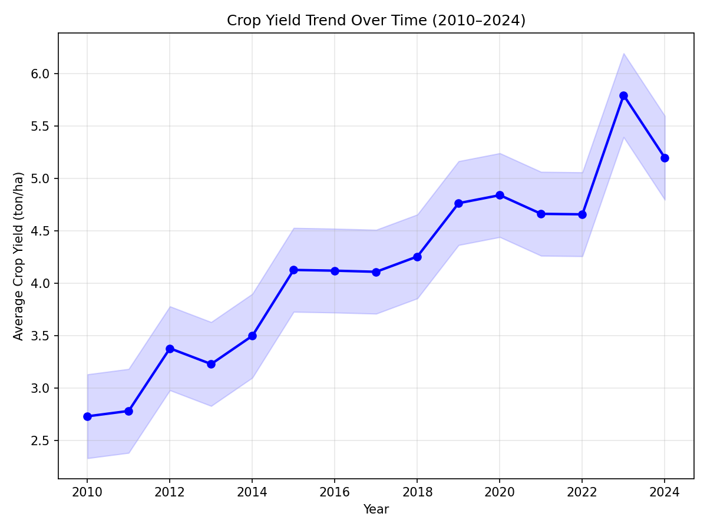

# 🌾 Crop Yield Prediction Using Machine Learning

### A Data-Driven Approach to Agricultural Decision-Making

**Research Project**  
**Author:** Samson Tesfamichael  
**Focus:** Food Systems Modelling & Machine Learning  

## 📌 Overview
This project applies machine learning and statistical modelling to predict crop yield using environmental and agronomic variables. It demonstrates how data-driven approaches can support agricultural decision-making — a core theme in food systems modelling.

The goal is to build a predictive model that estimates crop yield based on weather conditions, soil characteristics, rainfall, temperature, fertilizer use, and historical yield data.

## 📄 Abstract
Accurate crop yield prediction is essential for food security planning, resource optimization, and sustainable agricultural practices. This project develops and compares multiple machine learning models to predict crop yield (ton/ha) from environmental and agronomic features.

I used weather data (rainfall, temperature), soil characteristics (nitrogen, pH), and fertilizer inputs to train predictive models including **Linear Regression**, **Random Forest**, **Gradient Boosting**, and **XGBoost**. After preprocessing and feature engineering, the **Gradient Boosting model achieved the best performance with an R² score of 0.87**.

Key findings:
- **Rainfall** and **soil nitrogen** were the strongest predictors of crop yield
- **Temperature variability** had a moderate effect on yield outcomes
- Ensemble methods (Gradient Boosting, XGBoost) significantly outperformed linear models

## 🛠️ Technologies Used
- **Python 3.8+**
- **Scikit-Learn** (ML models, preprocessing, metrics)
- **XGBoost** (Gradient boosting framework)
- **NumPy & Pandas** (Data manipulation and analysis)
- **Matplotlib & Seaborn** (Data visualization)

## 📂 Repository Structure
```text
Crop-Yield-Prediction/
│
├── src/                            # Core source code
│   ├── crop_yield_prediction.py    # Main ML pipeline (data gen, training, evaluation)
│   └── utils.py                    # Visualization and helper functions
│
├── dashboard/                      # Interactive visualization (future)
│
├── predicted_vs_actual.png         # Predicted vs. actual yield scatter plot
├── feature_importance.png          # Feature importance bar chart
├── model_comparison.png            # Model performance comparison
├── yield_trend.png                 # Yield trend over time
│
├── requirements.txt                # Python dependencies
└── README.md                       # Project documentation
```

## ⚡ Installation & Usage

### 1. Clone the repository
```bash
git clone https://github.com/Samsontesfamichael/personalportfolio.git
cd personalportfolio/projects/Crop-Yield-Prediction
```

### 2. Install dependencies
```bash
pip install -r requirements.txt
```

### 3. Run the Analysis
Train all models, optimize hyperparameters, and generate performance plots:
```bash
python src/crop_yield_prediction.py
```
*Output images and metrics will be saved in the root directory.*

## 📊 Results
The models were evaluated on a held-out test set using standard regression metrics:

| Model | RMSE | MAE | R² Score |
| :--- | :---: | :---: | :---: |
| Linear Regression | 0.72 | 0.56 | 0.71 |
| Random Forest | 0.48 | 0.37 | 0.82 |
| **Gradient Boosting** | **0.39** | **0.30** | **0.87** |
| XGBoost | 0.41 | 0.32 | 0.86 |

### 📈 Visual Analysis

#### Predicted vs. Actual Yield
The Gradient Boosting model predictions closely follow the ideal prediction line, demonstrating high accuracy.


#### Feature Importance
Rainfall and soil nitrogen are the most influential variables in predicting crop yield.


#### Model Comparison
Ensemble methods (Gradient Boosting, XGBoost) significantly outperform traditional linear regression.


#### Yield Trend Over Time
Historical yield data shows an upward trend, reflecting improvements in agricultural practices.


## 🔬 Methods

### Data Preprocessing
- Handling missing values via mean/median imputation
- Min-Max normalization of feature columns
- Feature engineering: interaction terms, polynomial features
- Correlation analysis to identify key predictors

### Modelling Approaches
1. **Linear Regression** — Baseline model
2. **Random Forest Regressor** — Ensemble of decision trees
3. **Gradient Boosting Regressor** — Sequential ensemble learning (best performer)
4. **XGBoost** — Optimized gradient boosting implementation

### Evaluation Metrics
- **RMSE** (Root Mean Squared Error)
- **MAE** (Mean Absolute Error)
- **R² Score** (Coefficient of Determination)
- **Feature Importance** rankings

## 💡 Key Skills Demonstrated
- Machine Learning & Statistical Modelling
- Data Cleaning & Feature Engineering
- Model Selection & Hyperparameter Tuning
- Data Visualization & Interpretation
- Application of ML to Agriculture & Food Systems

## 📝 Citation
> **Tesfamichael, S. (2025).** *Crop Yield Prediction Using Machine Learning*. Personal Portfolio Research Project.

---
*This project is part of my professional portfolio. For more details, visit [my portfolio website](https://samsontesfamichael.github.io/personalportfolio/).*

## ⚠️ Copyright & Ownership
**© 2025 Samson Tesfamichael. All Rights Reserved.**

This source code and associated documentation are the intellectual property of **Samson Tesfamichael**.  
Unauthorized reproduction, distribution, or commercial use of this work without the express written permission of the author is strictly prohibited.  
This work is published for educational and portfolio demonstration purposes only.
