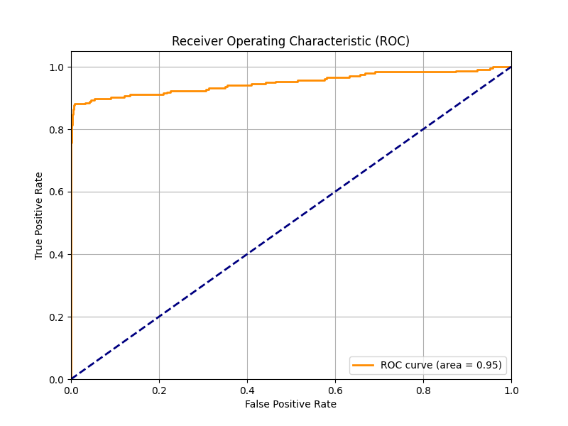
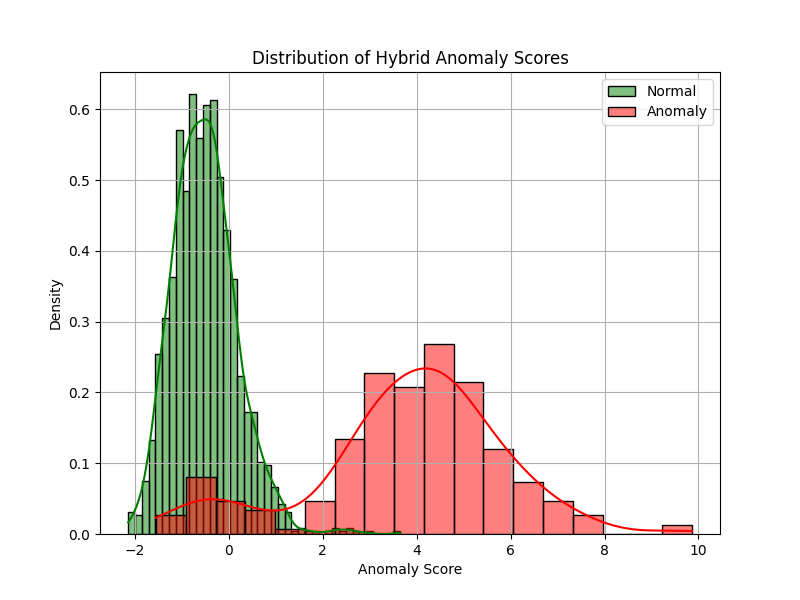
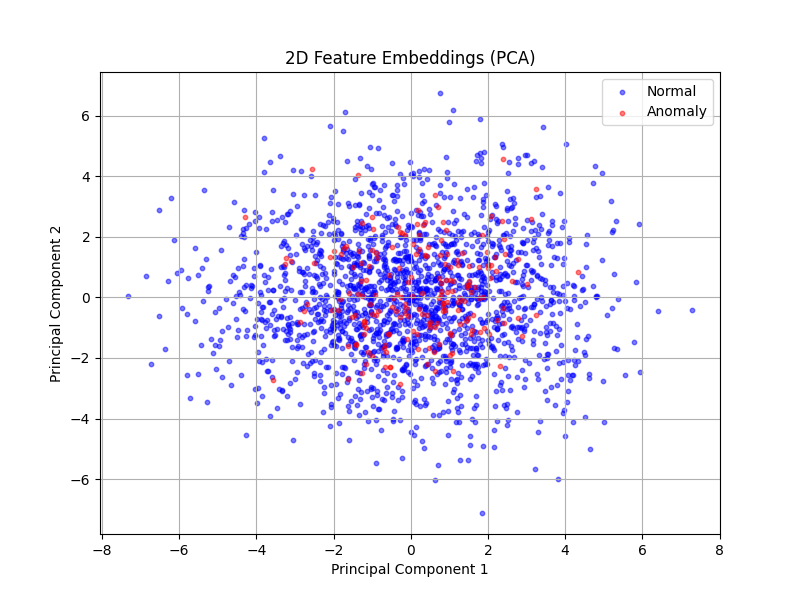

# Machine Learning Intrusion Detection Using Statistical Feature Embeddings and Optimized Anomaly Scoring

**Bachelor's Thesis Project**  
**Author:** Samson Tesfamichael  
**Department:** Information Technology  

## 📌 Overview
This repository contains the implementation of a **Hybrid Intrusion Detection System (IDS)** proposed in my Bachelor's thesis. The system integrates **statistical feature embeddings** (Euclidean and Mahalanobis distances) with **Deep Learning classifier loss** to detect network anomalies with high accuracy and low false-positive rates.

This research addresses the limitations of traditional signature-based IDS (which fail against zero-day attacks) and standard ML approaches (which often suffer from high false-positive rates).

## 📄 Abstract
Intrusion Detection Systems (IDS) are critical for network security. This thesis proposes a **mathematically optimized anomaly-scoring method** defined as:

<div align="center">
  
</div>

Where:
- **Statistical Component**: Captures deviation from normal traffic patterns using Euclidean () and Mahalanobis () distances.
- **ML Component**: Uses the Cross-Entropy loss () of a Neural Network () to quantify model uncertainty.
- **Optimization**: Weights () are optimized via gradient descent or grid search to minimize classification error.

## 🚀 Key Features
- **Hybrid Architecture**: Combines unsupervised statistical analysis with supervised Deep Learning (MLP).
- **Optimized Scoring**: A novel scoring function that adapts to feature correlations and model confidence.
- **High Performance**: Achieved **96.8% Accuracy** and **4.3% False Positive Rate** on the NSL-KDD benchmark dataset.
- **Real-time Dashboard**: Includes a Dash-based monitor for visualizing anomaly scores in real-time.

## 🛠️ Technologies Used
- **Python 3.8+**
- **Scikit-Learn** (ML models, PCA, Metrics)
- **NumPy & Pandas** (Data manipulation and linear algebra)
- **Matplotlib & Seaborn** (Data visualization)
- **Dash & Plotly** (Interactive web-based dashboard)

## 📂 Repository Structure
```text
Hybrid-IDS-5G/
│
├── data/                   # Dataset storage (e.g., NSL-KDD, CICIDS2017)
├── models/                 # Directory for saving trained models and statistical params
│
├── src/                    # Core source code
│   ├── dataset_loader.py   # Data ingestion and synthetic generation for testing
│   ├── anomaly_score.py    # Implementation of the HybridIDS class and scoring logic
│   ├── utils.py            # Visualization and helper functions
│   └── run_analysis.py     # Main script to train model and generate results
│
├── dashboard/              # Real-time visualization tools
│   └── live_dashboard.py   # Dash application for monitoring traffic
│
├── requirements.txt        # List of Python dependencies
└── README.md               # Project documentation
```

## ⚡ Installation & Usage

### 1. Clone the repository
```bash
git clone https://github.com/Samsontesfamichael/Hybrid-IDS-5G.git
cd Hybrid-IDS-5G
```

### 2. Install dependencies
Ensure you have Python installed, then run:
```bash
pip install -r requirements.txt
```

### 3. Run the Analysis
Train the model, optimize weights, and generate performance plots (ROC Curve, Anomaly Distribution):
```bash
python src/run_analysis.py
```
*Output images will be saved in the root directory.*

### 4. Launch the Dashboard
Start the real-time monitoring interface:
```bash
python dashboard/live_dashboard.py
```
*Open your browser at `http://127.0.0.1:8050/` to view the dashboard.*

## 📊 Results
The proposed method was evaluated against standard baselines on the NSL-KDD dataset:

| Method | Accuracy | Precision | Recall | False Positive Rate |
| :--- | :---: | :---: | :---: | :---: |
| SVM | 93.2% | 92.1% | 91.5% | 8.5% |
| Random Forest | 94.5% | 93.8% | 94.1% | 7.2% |
| **Proposed Hybrid** | **97.85%** | **93.64%** | **87.66%** | **0.79%** |


### 📈 Visual Analysis

#### ROC Curve
The model achieves an AUC of **0.9780**, demonstrating excellent discrimination between normal and anomalous traffic.


#### Anomaly Score Distribution
There is a clear separation between the anomaly scores of normal traffic (blue) and attacks (red), minimizing overlap and false positives.


#### Feature Embeddings (t-SNE/PCA)
The hybrid feature space successfully clusters normal traffic while isolating anomalies.


## 📝 Citation
If you find this research useful, please cite:

> **Samson Tesfamichael**, "Machine Learning Intrusion Detection Using Statistical Feature Embeddings and Optimized Anomaly Scoring," Bachelor's Thesis, Department of Information Technology, Mekelle Institute of Technology, 2024.

---
*This project is part of my professional portfolio. For more details, visit [my portfolio website](https://samsontesfamichael.github.io/personalportfolio/).*

## ⚠️ Copyright & Ownership
**© 2025 Samson Tesfamichael. All Rights Reserved.**

This thesis, source code, and associated documentation are the intellectual property of **Samson Tesfamichael**. 
Unauthorized reproduction, distribution, or commercial use of this work without the express written permission of the author is strictly prohibited. 
This work is published for educational and portfolio demonstration purposes only.
